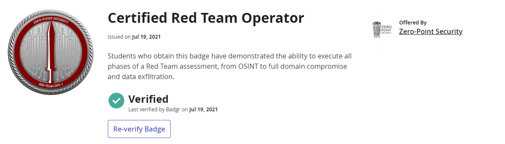
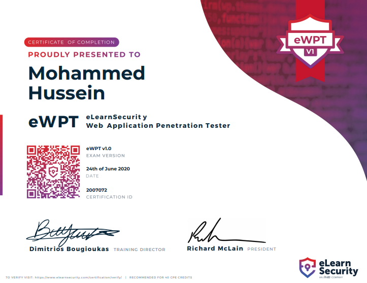

> **Note**: Add Markdown syntax content to file `tabs/about.md` and it will show up on this page.

Hello reader, My name is Mohammed or as known as Z0ldyck. I am a first-year student at Champlain College majoring in Cyber Security. I started learning about Network and Web Penetration Testing while I am in High School. Before High School, I had some experience with programming and Arduino.

# Certifications

### Certified Red Team Operator `(CRTO)`

### Offensive Security Certified Professional `(OSCP)`

### eLearnSecurity Certified Penetration Tester `(eCPPTv2)`

### eLearnSecurity Web Application Penetration Testing `(eWPT)`

### eLearnSecurity Junior Penetration Tester `(eJPT)`

### PentesterLab Badges
- Blue
- Intercept
- Serialize
- White
- Yellow
- Essential
- PCAP
- Unix

<html>
<head>
    <link href="style.css" type="text/css" rel="stylesheet">
</head>
<body>
    

        
        
        
        

            
            
            
        

        

            
            
            
        

    

</body>
</html>

# Achievements

### Registered three CVEs:
- CVE-2021-31760
- CVE-2021-31761
- CVE-2021-31762

### Acknowledged By (Webmin)

### CyberPatriot
First place ( 1st ) in Vermont’s CyberPatriot for three years in a row (2019 - 2021)
